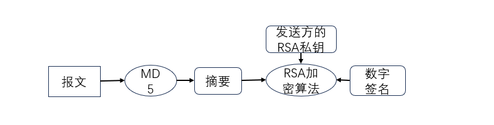
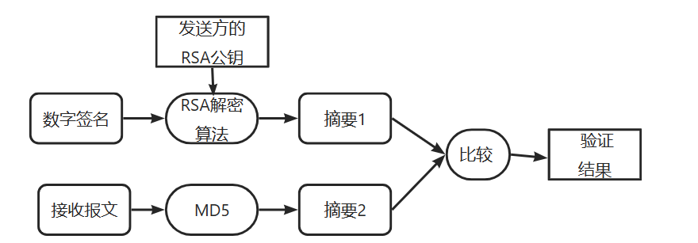
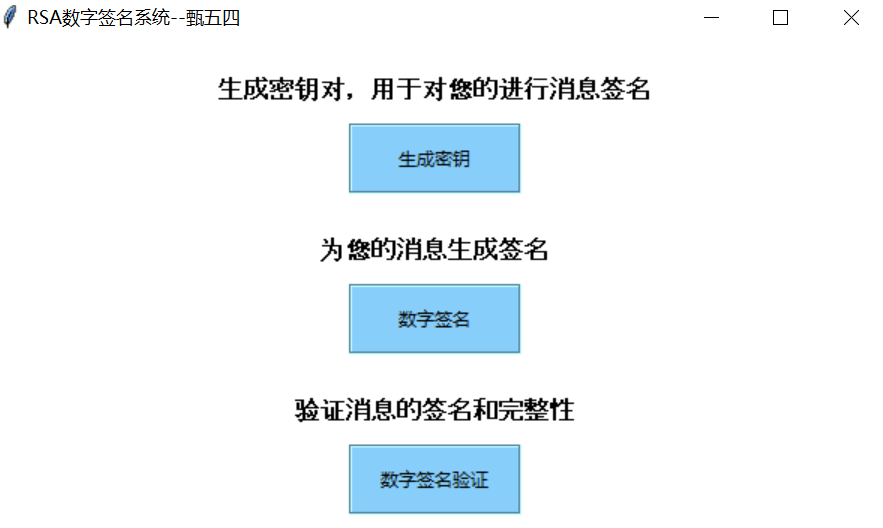
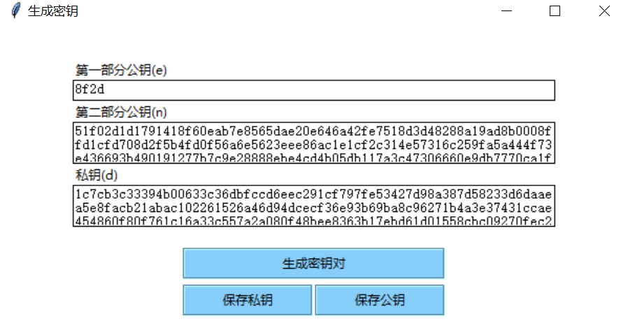
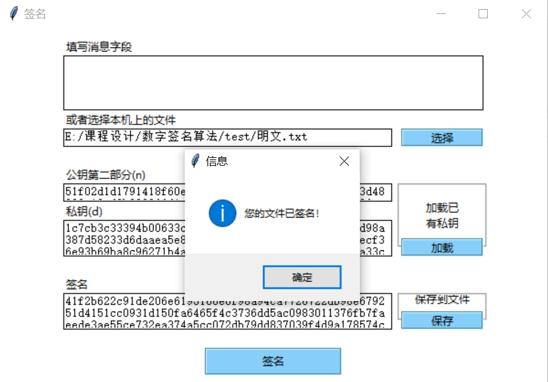

# 本仓库基于RSA公钥加密算法实现数字签名
##  数字签名过程

## 数字签名验证过程

#### 本系统主要由主页面、生成密钥页面、数字签名页面、数字签名验证页面4个部分组成，主页面可以选择生成密钥、数字签名、数字签名验证

#### 生成密钥页面可以生成密钥对生成数字签名过程中所需要的密钥，再次点击可以刷新密钥、我们的公钥e默认设置为16比特。可以点击保存公钥、保存私钥分别保存。

#### 数字签名页面需要先输入明文消息或者可以选择需要签名的文件。再选择私钥文件，点击签名即可得到数字签名结果，数字签名结果可以保存。

#### 数字签名验证页面也需要先输入明文消息或者可以选择需要签名的文件。再选择公钥文件，加载已签名结果。最后点击验证即可完成，显示签名有效则说明验证成功。

